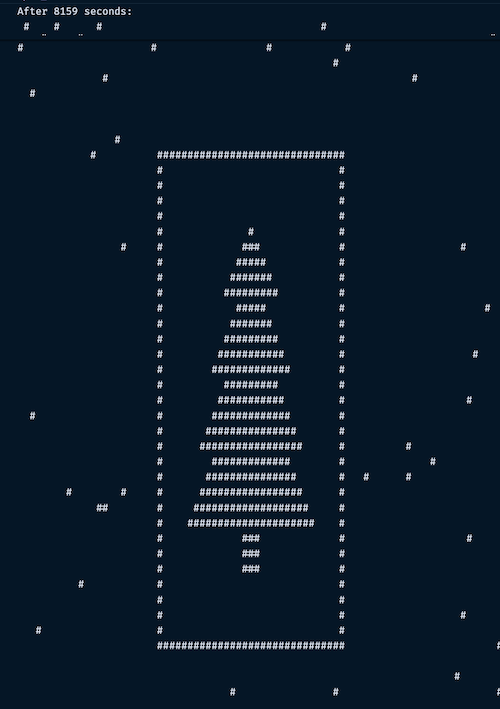

# What Am I Learning Each Day?

### Day 21

**Difficulty: 9/10 ★★★★★★★★★☆**

**Time: ~10 hr**

**Run Time: ~1ms**

Initially tried `A Star` for getting best paths from each key in each keypad, but it made for some bad paths.

```rust
#[derive(PartialEq, Eq)]
struct State {
    position: (isize, isize),
    path: Vec<char>,
    // a star include distance as proxy
    distance_from_empty: usize,
}

impl Ord for State {
    fn cmp(&self, other: &Self) -> std::cmp::Ordering {
        // other.cmp(self) is min-heap
        // self.cmp(other) is max-heap

        // order by min path len, but max distance from empty
        match other.path.len().cmp(&self.path.len()) {
            Ordering::Equal => self.distance_from_empty.cmp(&other.distance_from_empty),
            t => t,
        }
    }
}
```

This actually worked fine for part 1, though I might have had to clean up a few paths manually afterwards.  

Part 1 I got without losing too many days, but Part 2 was much more difficult.  Getting the correct paths for the keypads was the first frustration, but figuring out how to refactor to solve part 2 was more difficult (and I got help on Reddit, and from ChatGPT).  So, I had to figure out how to do it in depth-first-search, which meant a lot less mutable variables (didn't need `keypad.current` at all).  After figuring out how to make a `dfs` function that the compiler wouldn't complain about, the rest seemed simple.

```rust
// reworked this quite a bit: keypads is not mutable! (i.e. make it so we don't re-assign `.current`)
fn dfs(
    key: Vec<char>,
    i: usize,
    keypads: &Vec<Keypad>,
    // TIL: why this is not `mut memo`: we don't need/want to reassign `memo`
    memo: &mut HashMap<(Vec<char>, usize), usize>
) -> usize {
    // check if we're done
    if i == keypads.len() - 1 {
        return key.len();
    }

    // annoying clone here
    let k = (key.clone(), i);

    // did we do this before?
    if memo.contains_key(&k) {
        return *memo.get(&k).unwrap();
    }

    // get next
    // refactored from Vec<char> to Vec<Vec<>>
    // so we can take advantage of memoization
    let next = keypads[i].move_sequence(&key);

    let len = next
        .into_iter()
        .map(|p| dfs(p, i + 1, keypads, memo))
        .sum();

    // save to memo and return
    memo.insert(k, len);

    len
}
```

For part one, we can return `Vec<char>` from `move_sequence`, but part two needs as much memoization as possible, so we chunk it up by sequences including the final `'A'`.

I think today was the first time I used `extend` to extend a vector, which was a frustration all unto itself:

```rust
/**
 * Move from A, to a bunch of places, then press A
 * this is chunked into separate paths for memoization
 */
fn move_sequence(&self, keys: &Vec<char>) -> Vec<Vec<char>> {
    let mut cur = 'A';
    let mut path = vec![];

    for &next in keys {
        let mut inner = vec![];
        if let Some(p) = self.map.get(&(cur, next)) {
            inner.extend(p);
            cur = next;
        }
        inner.push('A');

        path.push(inner);
    }

    path
}
```

I also wasn't sure if folding is better than creating a mutable vector:

```rust
// is fold better than declaring `let mut next_path`?
// path gets updated for next keypad
path = path.iter().fold(vec![], |mut acc, &p| {
    // is there a better way to update and return Vec<char>?
    if let Some(travelled) = pad.move_to(p) {
        acc.extend(travelled);
    }
    // always push A
    acc.push('A');
    acc
});
```

I also updated the `Grid` type in lib to more easily iterate the cells:

```rust
pub fn iter(&self) -> impl Iterator<Item = (usize, usize, &T)> {
    self.cells
        .iter()
        .enumerate()
        .flat_map(|(r, row)| {
            row.iter()
                .enumerate()
                .map(move |(c, cell)| (r, c, cell))
        })
}
```

Which is probably the first time I've used `flat_map`, and this makes sense because I want a single iterator, and not a nested one.

I still find the Iterator trait odd, both for the `impl` and the `Item =` parts:

`impl Iterator<Item = (usize, usize, &T)>`

### Day 20

**Difficulty: 6/10 ★★★★★★☆☆☆☆**

**Time: ~3 hr**

**Run Time: ~150ms**

I made a mess out of using that `Vec<u8>` today, since I wrote that extremely naive getter method for it in Day 16:

```rust
fn move_from_cell(&self, dir: &(isize, isize), cell: isize) -> Option<isize> {
    let next = if dir.0 == 0 { cell + dir.1 } else { cell + dir.0 * (self.width as isize) };

    match self.cells[next as usize] {
        SPACE | END => { Some(next) }
        _ => { None }
    }
}
```

Today I had to rework it to basically check the x,y coord if it's valid and convert back into a vector index:

```rust
// something like (-3, 15) should have been off the map, but wasn't
fn move_from_cell(&self, dir: &(isize, isize), cell: isize) -> Option<isize> {
    // can't figure out the math, so converting to point
    let p = (cell / (self.width as isize), cell % (self.width as isize));

    let next = tup!(p + dir);

    if next.0 < 1 || next.1 < 1 || next.1 >= (self.width as isize) {
        return None;
    }

    // point back to cell index
    let next = next.0 * (self.width as isize) + next.1;

    // usng .get because *2 could overflow in any direction
    match self.cells.get(next as usize) {
        Some(&SPACE) | Some(&END) => { Some(next) }
        _ => { None }
    }
}
```

I suppose I still avoided a hashmap lookup, but I'd bet there are better ways to do that.

I was able to make a list of cells in a given manhattan distance, though it too might be a bit wasteful:

```rust
// get all direction diffs
let mut manhattans = vec![];

// had these wrong, since I didn't abs them in nested checks
for i in -cheat_dist..=cheat_dist {
    for j in -cheat_dist..=cheat_dist {
        if i.abs() + j.abs() <= cheat_dist {
            // ignore adjacent walls with <2
            if !(i.abs() < 2 && j.abs() < 2) {
                manhattans.push((i, j));
            }
        }
    }
}
```

Thankfully my print function helped a lot for debugging.

This was my first time using a `find_map`:

```rust
// move through the single-path track
let next = DIRS.iter()
    .find_map(|dir| {
        self.move_from_cell(&dir, current).filter(|&val| {
            // no cheat in this direction
            // check if unvisited
            // otherwise ignore
            times[val as usize] == -1
        })
    })
    .unwrap();
```

### Day 19

**Difficulty: 5/10 ★★★★★☆☆☆☆☆**

**Time: ~1 hr**

**Run Time: ~30ms**

Tried another Dijkstra.  Worked fine for part 1, but not part 2.

Tried finding shortcuts in Part 2, like tracking the largest possible patterrn; that seemed to halve the time.

Depth-first-search seemed like a must, and adding a memo was necessary for that to work.

Kind of annoying that I didn't need the bfs at all, as the dfs works great for both.

### Day 18

**Difficulty: 2/10 ★★☆☆☆☆☆☆☆☆**

**Time: ~30 min**

**Run Time: ~2s**

This seemed like a rehash of other days: just dijkstra for part 1, and iterate part 1 until we couldn't get an answer (slower I think using dijkstra, but maybe not).

It wasn't worth being smart about part 2, where being lazy only cost me 2 seconds of runtime.

I think it was my first time using `format!`:

```rust
fn part_two(maze: &Maze, start: usize) -> String {
    // repeat part one until we get '0'
    for i in start.. {
        if part_one(maze, i) == 0 {
            let pos = maze.bytes[i - 1];
            return format!("{},{}", pos.0, pos.1);
        }
    }
    "".to_string()
}
```

Also I moved my own `tup!` macro into the lib file:

```rust
// token trees below
#[macro_export]
macro_rules! tup {
    // unfortunate; can't use `state.position` as a `tt`
    ($lhs:expr, $op:tt, $rhs:expr) => {
        {
            ($lhs.0 $op $rhs.0, $lhs.1 $op $rhs.1)
        }
    };
    ($lhs:tt $op:tt $rhs:tt) => {
        {
            ($lhs.0 $op $rhs.0, $lhs.1 $op $rhs.1)
        }
    };
}
```

So now I can use `state.position` as a tuple, even though it is `3` tokens.

### Day 17

**Difficulty: 8/10 ★★★★★★★★☆☆**

**Time: ~6 hrs**

**Run Time: ~1ms**

I can never figure these ones out. I remember doing something like this for [day 24 2021](https://adventofcode.com/2021/day/24) in [Go](https://github.com/bozdoz/advent-of-code-2021/blob/d5a05a356413754afb38b7fdddf9aa5c28492d68/24/monad.go#L71)

And I tried to model it the same way:

```go
type Instruction interface {
	Exec(a *int, b int)
	String() string
}

type Command struct {
	left, right string
}

type Inp struct {
	Command
}

func (inp *Inp) Exec(a *int, b int) {
	*a = b
}

type Add struct {
	Command
}

func (add *Add) Exec(a *int, b int) {
	*a += b
}
```

But I couldn't easily do this in Rust:

```rust
trait Instruction {
    fn run(program: &mut Program, operand: usize) -> ();
}

struct Bxl {}

impl Instruction for Bxl {
    fn run(program: &mut Program, operand: usize) {
        let lhs = program.b;
        let rhs = operand;

        program.b = lhs ^ rhs;
    }
}
```

The trait became meaningless because I couldn't associate it with the Program struct (it wasn't actually much better in Go).

So that day was to find a number from 0 to 9^14, and today was find a number somewhere around 8^16.

In 2021 I apparently successfully bruteforced the answer within 12 minutes, by removing all the ridiculous structs and just did plain math in a single function.  This year I just tried to brute force it without any optimizations (I did try some threads).

I found a repo I could understand and modeled my answer after this: https://github.com/maneatingape/advent-of-code-rust/blob/main/src/year2024/day17.rs

Otherwise, today I went far too hard on structs.  The parser was awful, though it was the first time I used the question mark returns:

```rust
fn run(&mut self) -> Option<()> {
    loop {
        // first time using question marks
        let inst: &usize = self.input.get(self.pointer)?;
        // dereference to avoid borrowing as immutable
        let next: usize = *self.input.get(self.pointer + 1)?;

        // bump pointer by 2
        self.pointer += 2;

        (match inst {
            0 => Adv::run,
            1 => Bxl::run,
            2 => Bst::run,
            3 => Jnz::run,
            4 => Bxc::run,
            5 => Out::run,
            6 => Bdv::run,
            7 => Cdv::run,
            _ => panic!("what instruction is this? {inst}"),
        })(self, next);
    }
}
```

This was mostly to avoid repetitive checking for values.

Part 2 was inevitably a DFS by running every three bits through the program, shifting by 3 bits, pushing all potential answers to a vector and then returning the minimum.  My understanding of it is that the output is always modulo 8 which would be the first 3 bits of a number, so only the first three bits of A were ever going to impact the output.

### Day 16

**Difficulty: 8/10 ★★★★★★★★☆☆**

**Time: ~6 hrs**

**Run Time: ~500ms**

I seem to have completely forgot how to do dijkstra's algo.

I seem to need to use a priority queue, because we need to find the quickest paths first.  If I swapped these, I would get a completely different answer:

```rust
// let mut heap = vec![];
   let mut heap = BinaryHeap::new();
```

Also I keep forgetting that dijkstra's keeps track of visited nodes globally, not per state.  So State (in part 1) can just be:

```rust
#[derive(PartialEq, Eq)]
struct State {
    // pos, direction
    current: (isize, usize),
    cost: usize,
}
```

This may have been my first actual dijkstra in rust.

This time I tried a grid as a `Vec<u8>`, which actually worked pretty well (except for printing):

```rust
struct Maze {
    start: isize,
    end: isize,
    // try something different
    cells: Vec<u8>,
    width: usize,
}

const SPACE: u8 = b'.';
const END: u8 = b'E';

fn _print_maze(maze: &Maze) {
    // use chunks to simulate 2d grid
    for c in maze.cells.chunks(maze.width) {
        println!(
            "{:?}",
            c
                .iter()
                .map(|&x|
                    char
                        ::from_u32(x as u32)
                        .unwrap()
                        .to_string()
                )
                .collect::<Vec<_>>()
                .join("")
        );
    }
}
```

Debugging was a little awkward as I wanted to print out an 'X' in a given cell:

```rust
fn _print_x_in_maze(maze: &Maze, cell: isize) {
    // converts cell index to (r,c)
    let find = ((cell as usize) / maze.width, (cell as usize) % maze.width);
    for (r, row) in maze.cells.chunks(maze.width).enumerate() {
        let mut out: Vec<String> = vec![];
        for (c, val) in row.iter().enumerate() {
            if (r, c) == find {
                out.push("X".to_string());
            } else {
                out.push(
                    char
                        ::from_u32(*val as u32)
                        .unwrap()
                        .to_string()
                );
            }
        }
        println!("{}", out.join(""));
    }
}
```

I find these ouputs so odd, stil; (`&str` to `String`, and `u8` to `char`):

```rust
out.push("X".to_string());

out.push(
    char
        ::from_u32(*val as u32)
        .unwrap()
        .to_string()
);
```

Surprisingly I actually didn't need to track the walls at all.

### Day 15

**Difficulty: 7/10 ★★★★★★★☆☆☆**

**Time: 3 hrs**

**Run Time: ~7ms**

I feel like I went overboard with structs.

I also made a kick-ass macro for all future use:

```rust
// token trees below
macro_rules! tup {
    ($lhs:tt $op:tt $rhs:tt) => {
        {
            ($lhs.0 $op $rhs.0, $lhs.1 $op $rhs.1)
        }
    };
}
```

All this because I hate updating point-like tuples with simple math.  So now I can do:

```rust
tup!((2,2) + (1,1));
tup!((2,2) - (1,1));
```

Instead of:

```rust
(2 + 1, 2 + 1)
```

I cloned the map struct in each part today, and mutated the maps in multiple methods, including part two's `double_the_width`, which just updates the width and cell_width, filling in all the boxes everywhere.

I really liked the match statement for part 1 (also used in part 2 for horizontal moves):

```rust
let mut found_boxes = false;
loop {
    pos.0 += dir.0;
    pos.1 += dir.1;

    match self.grid.get(&pos) {
        None => {
            // can move
            break;
        }
        Some(Thing::Box) | Some(Thing::LBox) | Some(Thing::RBox) => {
            // might be able to move
            found_boxes = true;
            continue;
        }
        Some(Thing::Wall) => {
            // can't move
            return;
        }
    }
}
```

The breakdown between `break`, `continue`, and `return` felt like I covered everything.

I tried to return an iterator for the gps coordinates instead of a collection but it made for awkward code:

```rust
fn get_gps_coords(self) -> impl Iterator<Item = isize> {
    // part 1 counts box; 2 counts LBox
    let find = if self.cell_width == 1 { Thing::Box } else { Thing::LBox };

    // first `move`?
    self.grid.into_iter().filter_map(move |((r, c), thing)| {
        if thing == find {
            return Some(r * 100 + c);
        }
        // unbelievable
        None::<isize>
    })
}
```

I couldn't use `&self` in the method, I had to use `into_iter` and I had to use `move`.  Also, I have no idea why I had to type the `None` as `None::<isize>` (looks like I can remove that now, for some reason).  I think it's fine since it's the last method I need to call in the function; otherwise I think it wouldn't work.


### Day 14

**Difficulty: 8/10 ★★★★★★★★☆☆**

**Time: 4 hrs**

**Run Time: ~2ms**

I couldn't really figure out how to get the number for the Christmas Tree image:

;

So what I did was print out ~200 snapshots and scanned them quickly to see when the robots aligned vertically and horizontally: it was 22 and 125 vertically, and 79 and 180 horizontally.  I saw the difference was identical to height and width (maybe obviously though wasn't obvious to me).  I changed part_two from the chinese remainder theorem (couldn't get it to work), to just iterate to infinity and find when the cycles meet:

```rust
fn part_two() -> usize {
    // 22 is when it appeared vertically centered
    // 79 is when it appeared horizontally centered
    // the other numbers are height and width (when it wraps)
    for time in 0.. {
        if time % 103 == 22 && time % 101 == 79 {
            return time;
        }
    }
    0
}
```

I did eventually get a working chinese remainder theorem, but it feels intense, and ChatGPT got it wrong multiple times.  It was only after I found the answer myself that I could corect it enough to get it to help me finish the functions.

Honestly my solution is briefer, and I'd take it anyday over fighting to grasp modular inverses.

I don't think I needed to define a `Point` today.  That was probably overkill.

Defining the `World` I thought was worth while.  I liked defining `after_time` for each, to help wrap the robots around the "world".

```rust
impl World<'_> {
    fn after(&self, time: usize) -> Vec<Robot> {
        self.robots
            .iter()
            .map(|r| {
                Robot {
                    position: self.wrap(r.after(time)),
                    ..*r // first time spreading?
                }
            })
            .collect()
    }
```

This was my first time spreading structs, and I didn't like the syntax at all (relative to JavaScript).

I had to define `Display` in order to print out the world and see the robot locations.

I used a display `fill` in order to swap between how AOC printed the maps, and how I wanted to print it for part 2 with higher contrast.

I used regular expressions again today to parse the input data.  I ran it without `^` and `$` so it would capture multilines.

### Day 13

**Difficulty: 6/10 ★★★★★★☆☆☆☆**

**Time: 3 hrs**

**Run Time: 330µs**

I never see these linear algebra problems coming and I can't remember any of it from school.

Had some fun implementing math operations for a (usize, usize):

```rust
struct Point(usize, usize);

impl Add for Point {
    type Output = Self;

    fn add(self, rhs: Self) -> Self::Output {
        Point(self.0 + rhs.0, self.1 + rhs.1)
    }
}

impl Div for Point {
    type Output = Self;

    fn div(self, rhs: Self) -> Self::Output {
        Point(self.0 / rhs.0, self.1 / rhs.1)
    }
}

impl Mul<usize> for Point {
    type Output = Self;
    fn mul(self, rhs: usize) -> Self::Output {
        Point(self.0 * rhs, self.1 * rhs)
    }
}

impl PartialOrd for Point {
    fn gt(&self, other: &Self) -> bool {
        self.0 > other.0 && self.1 > other.1
    }
    fn partial_cmp(&self, other: &Self) -> Option<std::cmp::Ordering> {
        if *self > *other {
            return Some(Ordering::Greater);
        }
        None
    }
}
```

This implements (respectively):

```
(usize, usize) + (usize, usize)
(usize, usize) / (usize, usize)
(usize, usize) * usize
(usize, usize) > (usize, usize)
```

First solution I tried to work my way backward from maximum B tokens to maximum A tokens, and it worked fine for Part A.  I looked up an intersection equation online after seeing the recommendation on Reddit, by `u/CorvusCalvaria`.

### Day 12

**Difficulty: 7/10 ★★★★★★★☆☆☆**

**Time: 3 hrs**

**Run Time: 30ms**

I spent awhile trying to move the Grid iteration in the shared lib, but couldn't figure out `impl Iterator` and `impl IntoIterator` where it required both a lifetime and a generic type.  I did a custom iterator last year, but I think it didn't have either of those two issues.  I couldn't figure out borrowing with a generic type in the Iterator definition.

Anyway, I did move `DIRS` to the lib, as it was imported multiple times.

I also tried to use some kind of flood fill algorithm like I did in [2022, day 18](https://github.com/bozdoz/advent-of-code-2022/blob/main/18/cubes.go), though I spent more time trying to use a recursive closure that mutated data ([but failed trying these out](https://stackoverflow.com/questions/16946888/is-it-possible-to-make-a-recursive-closure-in-rust)).  I instead opted for a recursive function, though the parameters got annoying to constantly pass.

```rust
fn flood(
    grid: &Grid,
    cell: (isize, isize),
    check: &char,
    visited: &mut HashSet<(isize, isize)>
) -> (usize, usize) {
```

I don't think I achieved anything cool today, or tried anything new other than the above (which I failed at).

To solve part 2 I made an algorithm modeled after [this video I saw on reddit](https://www.reddit.com/media?url=https%3A%2F%2Fpreview.redd.it%2F16speesmxh6e1.gif%3Fwidth%3D1280%26format%3Dmp4%26s%3De8ff9cd627ee7cd8e5186fffe16c49f466148dc6).

I just found the code annoying to write today.  Many instances of the compiler complaining about having too many mutable or too many borrows or borrows with mutable, etc.

Somehow, I wasn't able to do this (which I often try): 

```rust
let mut visited = HashSet::new();

for (r, row) in grid.cells.iter().enumerate() {
    for (c, cell) in row.iter().enumerate() {
        let coords = (r as isize, c as isize);
        
        if visited.contains(&coords) {
            continue;
        }
```

Because I was writing to `visited` later.  I can't read it and write to it, even though it seems like a straight forward algorithm.

However, somehow I was able to do this:

```rust
let mut found: HashSet<(isize, isize)> = HashSet::new();
for cell in region {
    if found.contains(cell) {
        continue;
    }
    // ...
    found.insert(*cell);
```

Why was that allowed!?  It's somehow not the same, but it definitely looks like it at a glance.

I did like this quick logic for getting adjacent directions:

```rust
// if top, go left, then right...
let left = (missing_dir.1, missing_dir.0);
let right = (-missing_dir.1, -missing_dir.0);
```

`left` and `right` are subtitutes but decent examples of what it's doing (if the direction is `top`): reversing the tuple, and adding minus to one of them.

Otherwise, a lot of code.  Both parts worked surprisingly well without any bugs at all.  My only struggles today was with the compiler.

### Day 11

**Difficulty: 5/10 ★★★★★☆☆☆☆☆**

**Time: 2 hrs**

**Run Time: 15ms**

Today threw me, specifically with the wording in the puzzle:  

> No matter how the stones change, their order is preserved, and they stay on their perfectly straight line.

This made me think maybe I should look for a pattern in the iterations, made me think I should run the simulation on each rock at a time...

Anyway, There were enough duplicate numbers in part 1's output, and none of the stones impacted any other stone, which made me think a hashmap was probably fine to use.

First time using `.ok()` for the parser (it's a weird name for a method):

```rust
data.trim()
    .split(" ")
    .filter_map(|x| { x.parse::<usize>().ok() })
    .collect()
```

Filter map expected an `Option`, so that works great to convert the `Result` and drop any strings that fail.

First time creating a macro, and I think I get it now. I think it literally substitutes the lines inside with the use of it:

```rust
macro_rules! update_or_create {
    ($map:expr, $key:expr, $val:expr) => {
        {
            $map.entry($key)
                    .and_modify(|x| {
                        *x += $val;
                    })
                    .or_insert($val);
        }
    };
}
```

Now this can be used with a HashMap (though I'm not sure how to restrict types here):

```rust
let mut current: HashMap<usize, usize> = HashMap::new();

for &datum in data {
    update_or_create!(current, datum, 1);
}
```

I think this is different, because it doesn't create/define a new function, but rather substitutes the macro at compile time.  As I mentioned above, it seemed incredibly easy to write, because it doesn't appear typesafe (though it apparently is)! :D

So each iteration, I create a new hashmap, then copy the current hashmap over to the next one, then swap their memories:

```rust
mem::swap(&mut current, &mut next);
```

I think this is efficient.

I used some of the same math as Day 7 to get the number of digits, which I also used to split the numbers:

```rust
// get number of digits in the number
let digits = k.ilog10() + 1;
```

### Day 10

**Difficulty: 1/10 ★☆☆☆☆☆☆☆☆☆**

**Time: 0.5 hrs**

**Run Time: 10ms**

Took some more time to update the lib Grid definition.

Now I have the Grid cell values in a generic type:

```rust
pub struct Grid<T = char> {
    pub cells: Vec<Vec<T>>,
    pub height: isize,
    pub width: isize,
}
```

With two definitions for creation:

```rust
impl Grid<char> {
    pub fn new_with_chars(data: &str) -> Self {} 
}

impl Grid<u32> {
    pub fn new_with_u32(data: &str) -> Self {}
}
```

And I just added a private helper to deduplicate further, since most of the grid initialization is the same.  And I copied over the getter function 

This one I accidentally did part 2 before part 1, because I misread the instructions.

I successfully extracted the logic from part 1 into a function, and re-used it by passing a function in each parts.

```rust
fn part_one(grid: &Grid<u32>) -> usize {
    parts_one_and_two(grid, |complete, state| {
        complete.insert((state[0], state[9]));
    })
}

fn part_two(grid: &Grid<u32>) -> usize {
    parts_one_and_two(grid, |complete, state| {
        complete.insert(state);
    })
}
```

Which is basically, iterate the grid, add all the zeroes to a stack, and for each item in the stack, go through the directions.  When a stack item is complete, execute a given function, to add it to a `HashSet`.  The length of the hashset was the answer, so it all depended on which items were unique to the set.

### Day 9

**Difficulty: 3/10 ★★★☆☆☆☆☆☆☆**

**Time: 1 hrs**

**Run Time: 300ms**

First time using `repeat_n` (until I removed it), and maybe `cycle`.

Tried not to overthink the data structure too much.  I figured I could just make a large 1-dimensional array, so I tried that first with `cargo run`, and it worked fine so I went with that.

```rust
let mut out: Vec<Option<usize>> = vec![];
```

Each char was iterated within a `cycle` loop as to whether it was a file or space between:

```rust
for &is_file in [true, false].iter().cycle() {
```

Then I used `repeat_n` to add as many items as the digit:

```rust
if is_file {
    out.append(
        &mut repeat_n(id, digit as usize)
            .map(|x| Some(x))
            .collect()
    );
    id += 1;
} else {
    // append empties
    out.append(&mut repeat_n(None, digit as usize).collect());
}
```

Thankfully the rust analyzer told me I needed the iterator to have `&mut` or I never would have guessed.

UPDATE: I removed `repeat_n` in favor of the easier `&mut vec![None; digit as usize]`

Part one felt so clean, other than the `clone` of the data:

```rust
// move files one at a time
let mut copy = data.clone();
let mut s = 0;
let mut e = data.len() - 1;

loop {
    // each numbers towards each other
    while copy[s].is_some() {
        s += 1;
    }

    while copy[e].is_none() {
        e -= 1;
    }

    if e <= s {
        break;
    }

    // s is none; e is some; swap
    copy.swap(s, e);
}

// map_while works because there are no empty gaps in between
return copy.iter()
    .map_while(|&x| x)
    .enumerate()
    .fold(0, |acc, (i, v)| { acc + i * v })
```

I've been using `fold` a lot.  Anyway, I liked the brevity of that `loop`, and how simple it was to increment `s` and decrement `e`.

Part 2 I didn't know when to increment `s`, so I just left it. 

I think this is the first time using `take_while`:

```rust
let need = (0..=e)
    .rev()
    .take_while(|&x| { copy[x] == Some(item) })
    .count();
```

That takes from the end, until it gets an item that isn't identical and returns the count.

I pretty much fumbled my way through the rest with a bunch of print statements until I covered all the tests.


### Day 8

**Difficulty: 2/10 ★★☆☆☆☆☆☆☆☆**

**Time: 1 hrs**

**Run Time: 500µs**

I took the time to put the Grid struct into the `lib.rs` for reuse.  Today was another easy day.  Might have been my first time using the HashMap `and_modify().or_insert()` methods:

```rust
antennas
    .entry(cell)
    .and_modify(|e: &mut Vec<(isize, isize)>| {
        e.push((r as isize, c as isize));
    })
    .or_insert(vec![(r as isize, c as isize)]);
```

Today all it was was getting the difference between every two antenna and extrapolating it further in each direction.  In the second part you also have to include the antennas, which means keeping a `HashSet`.

### Day 7

**Difficulty: 1/10 ★☆☆☆☆☆☆☆☆☆**

**Time: 0.5 hrs**

**Run Time: 76ms**

I think this is the first time I defined a closure as a function parameter:

```rust
fn is_truthy(&self, get_next: impl Fn(&mut Vec<(usize, usize)>, (usize, usize)) -> ()) -> bool
```

Which was used to deduplicate the stack (I think depth-first search) logic:

```rust
if
    eq.is_truthy(|states: &mut Vec<(usize, usize)>, next: (usize, usize)| {
        // same as part one
        let acc = next.0;
        let i = next.1;
        let num = eq.numbers[i];
        states.push((acc + num, i + 1));
        states.push((acc * num, i + 1));

        // adds concatenated to part two
        let concatenated = acc * (10usize).pow(num.ilog10() + 1) + num;
        states.push((concatenated, i + 1));
    })
```

That concatenated line I got from reddit, but made sense to me for digit counting.

Today felt like a very idiomatic rust day.

### Day 6

**Difficulty: 6/10 ★★★★★★☆☆☆☆**

**Time: 4 hrs**

**Run Time: 175ms**

Reused a lot of grid stuff from Day4.  I might add to a library for it to deduplicate.

I thought I would be able to define a variable with the output of a block, but I wasn't able to `return` in it:

```rust
let start = {
    let mut out = (0, 0);
    'stupid: for (r, row) in cells.iter().enumerate() {
        for (c, &cell) in row.iter().enumerate() {
            if cell == '^' {
                out = (r as isize, c as isize);

                // not able to return in a block
                break 'stupid;
            }
        }
    }
    out
};
```

Better to rewrite it without the block anyway I guess, with a `find_map`.

I did a bunch of craziness with directions, binaries, and modulus:

```rust
// (r, c) differences, clockwise
const DIRS: &'static [(isize, isize)] = &[
    (-1, 0), // top
    (0, 1), // right
    (1, 0), // bottom
    (0, -1), // left
];

let bin = (2usize).pow((d % 4) as u32);
let dir = DIRS[d % 4];
```

The binary was to add multiple directions to an individual visited cell; the modulus was to continue iterating the direction constant.

I basically copied the same loop three times, but didn't want to deduplicate any of it.  

I basically:

1. looped the directions
2. looped getting the next cell towards a given direction
3. checked if we hit an obstacle or went off the map

Part two is kind of nested, where for each cell we run the simulation as if there's an obstacle there, then keep traversing.

Loop detection was simply: 

```rust
let mut visited = vec![vec![0; self.width as usize]; self.height as usize];

// first time using mutable reference?
let cell = &mut visited[next.0 as usize][next.1 as usize];

// check if the cell has the direction we're currently moving in
if (*cell & bin) == bin {
    return true;
}

// add direction to the visited list
*cell |= bin;
```

This I thought was convenient, since I only had to access the 2d array once, as a mutable reference.

I kept a hashset of visited cells because each cell could either be an obstacle or not: If it was visited previously it was ignored regardless.

### Day 5

**Difficulty: 4/10 ★★★★☆☆☆☆☆☆**

**Time: 1 hrs**

**Run Time: 134ms**

Both parts had a similar logic where I searched for the second number and then searched after it to see if the first was incorrectly placed.

During parsing I ran into annoying lifetime errors, but I seemed to be able to solve them after some DuckDuckGo searches, and used `where` I think for the first time:

```rust
struct SafetyManual<'a> {
    rules: Vec<(&'a str, &'a str)>,
    pages: Vec<Vec<&'a str>>,
}

impl<'a> SafetyManual<'a> {
    // first where; I don't understand it
    fn new<'b>(data: &'b str) -> Self where 'b: 'a {
```

I think there were too many references going on and maybe it didn't know which was which, but I think this means that the output lives as long as the input?

Without it it complains: 

> explicit lifetime required in the type of `data`

I decided not to parse the numbers and leave them as `&str` and maybe that was more costly than just parsing them immediately.  

I looked up a bubble sort in rust, and used that to re-order the pages based on the rules.

I've started adding reference symbols in the variable declaration instead of where I need them, and today I think was my first time using `swap`:

```rust
'outer: for &(first, second) in manual.rules.iter() {
    for i in 0..page.len() {
        if page[i] == first {
            continue 'outer;
        }
        if page[i] == second {
            // look for first and swap
            for j in i..page.len() {
                if page[j] == first {
                    page.swap(i, j);
```

It's a lot of loops and conditions, but it runs quick enough at `134ms`.


### Day 4

**Difficulty: 1/10 ★☆☆☆☆☆☆☆☆☆**

**Time: 0.5 hrs**

**Run Time: 2ms**

I did today completely on [Rust Playground](https://play.rust-lang.org/).  It seemed very straight forward, especially given I remembered the issues I had last year with Grid/Cell iteration `Vec<Vec<_>>`.  I did it all within a single main function, without tests, then copied them over here for source control, adding tests, and splitting out functions and `struct`'s.  It did make me think I could save some amount of time by sticking to simple functions, but I'd rather do things that might better represent a real world app.

One thing I noticed is that when I moved to my typical structure, I couldn't easily create the struct I needed for the grid.

```rust
impl Grid {
    fn new(data: &str) -> Self {
        let cells: Vec<_> = data
            .lines()
            .map(|l| { l.chars().collect::<Vec<_>>() })
            .collect();

        // surprisingly not valid if added directly to the `Self` block below
        let height = cells.len() as isize;
        let width = cells[0].len() as isize;

        Self {
            cells,
            height,
            width,
        }
    }
}
```

For some reason I think related to lifetimes, I couldn't do this:

```rust
Self {
    cells,
    height: cells.len() as isize,
    width: cells[0].len() as isize,
}
```

The error is:

> borrow of moved value: `cells`

I thought the iterations today were clean: I found all `X`'s and then iterated directions repeatedly to see if all letters matched.

```rust
// (r, c) differences, clockwise
const DIRS: &'static [(isize, isize)] = &[
    (-1, 0), // top
    (-1, 1), // tr
    (0, 1), // right
    (1, 1), // br
    (1, 0), // bottom
    (1, -1), // bl
    (0, -1), // left
    (-1, -1), // tl
];
```

I find the `&'static` lifetime declaration a little annoying, but it works fine.

```rust
for dir in DIRS {
    let mut nextr = r;
    let mut nextc = c;

    for &ch in SEARCH {
        nextr += dir.0;
        nextc += dir.1;
```

Here I increment row and column and keep checking for the next letter in `SEARCH`.

Part 2 was similar thoough had some extra logic to determine if exactly `S` and `M` are matched around the `A`'s.

```rust
// looking for an X shape
const DIAGONALS: &'static [(isize, isize)] = &[
    (-1, -1), // tl
    (1, 1), // br
    (-1, 1), // tr
    (1, -1), // bl
];

for dirs in DIAGONALS.chunks(2) {
    let mut acceptable = vec!['S', 'M'];
    // ...
    // ...
    // ...
    let ch = &grid.cells[nextr as usize][nextc as usize];

    if acceptable.contains(ch) {
        // remove from acceptable and search next diagonal
        acceptable.retain(|x| x != ch);
    }
```

I think it's the first time I've used `chunks` and I'm not sure if it's the first time I've used `retain`, though I remember it's a difficult method to remember (because I'd prefer something like `remove`).

### Day 3

**Difficulty: 1/10 ★☆☆☆☆☆☆☆☆☆**

**Time: 0.5 hrs**

**Run Time: 4ms**

I had to install `regex` again.

This was my first time using `captures_iter` or `captures`, and I'm not sure if there are better methods to do what I did with the data parser.

The second part was pretty simple to add another regex and `match` against which pattern was captured:

```rust
// track mul's initially
let mut track = true;

for a in re.captures_iter(data) {
    let (_full, [capture]) = a.extract();

    match capture {
        "do()" => {
            track = true;
        }
        "don't()" => {
            track = false;
        }
        _ => {
            // mul(digit, digit)
            if track {
```

Then I used `fold`, which I think is appropriate since `reduce` required the input data to be identical to the output data, and I was converting `(usize, usize)` to `usize`.

### Day 2

**Difficulty: 5/10 ★★★★★☆☆☆☆☆**

**Time: 2 hrs**

**Run Time: 2ms**

**--UPDATE--**

I rewrote the data parser to return an iterator into the data instead of collecting into a 2d vec.  It didn't improve time at all.  Maybe it manages memory better.  Here's the new parser:

```rust
fn parse_data(data: &str) -> impl Iterator<Item = Vec<isize>> + use<'_> {
    data.lines().map(|x| {
        x.split_ascii_whitespace()
            .map(|y| { y.parse::<isize>().expect("I thought this was a number") })
            .collect::<Vec<isize>>()
    })
}
```

The rust prettier extension fails to format this now, because it cannot detect the `use` keyword: https://github.com/jinxdash/prettier-plugin-rust/issues/38

This is my first time trying to return an `Iterator`, and I realized it's not the same type that I've been using; namely:

```rust
fn has_issues(report: &Vec<isize>) -> Option<isize> {
    let mut iter: std::slice::Iter<'_, isize> = report.iter();
```

The normal `iter()` method returns a `slice::Iter`, which has methods like `clone()`, which `Iterator` doesn't have.  So, not sure why such a distinction is made here.

Also if I want to pass this iterator to a function, I need to define it as such:

```rust
fn part_one<I>(reports: I) -> usize
where 
    I: Iterator<Item = Vec<isize>>
```

**--END UPDATE--**

I got bogged down with both parts today, because the test data passed and the real data failed (both times).  The first time, it was because I checked the first two digits to determine the direction, before I tested for valid differences:

```diff
- if diff == 0 {
+ if diff == 0 || diff.abs() > 3 {
    return Some(1);
}
```

I ended up reworking it to re-iterate all of the numbers after getting the direction (up/down).

My solution to part 2 was to try to validate the report, and if it failed, return the index it failed on, then remove that index and try again.  I followed up a second time by removing the index before the failed one.  Neither perfectly worked, so I ended up trying every index possible, and it ran perfectly fine in under 2ms anyway.

Alright, so I ran both the correct algorithm and the bad one, and compared outputs, and found the problem:

```
47 45 46 47 49
```

This one would fail on index 2, my algorithm would try to remove it, then remove the one before it.  It needed to remove the one before that (the first one).  This failed because I believed I needed to determine the direction before testing, so I treated the first two values as a special case.  So the failed cases were the ones where I got the initial direction incorrect.

I had a difficult time cloning for some reason:

```rust
// SUPER ULTRA LAZY just iterate everything...
for i in 0..x.len() {
    // WOW: rust is difficult to fight with
    let clone: Vec<isize> = x
        .iter()
        .enumerate()
        .filter_map(|(j, v)| {
            if i == j {
                return None;
            }
            Some(*v)
        })
        .collect();
}
```

I wasn't able to just plain clone it because then I needed to mutate it to remove the value I wanted removed, and I wasn't sure how to do that without making the `x` variable mutable, which was a huge pain.

I found the general logic a bit awkward:

```rust
.filter_map(|x| {
    if has_issues(x).is_some() {
        return None;
    }
    Some(x)
})
```

I'd love to be able to just flip `None` to `Some` in that case, but that's the best I could come up with.  I also didn't need to return the `x` vector, but I liked the `filter_map` syntax better than `filter`.

Actually, testing that, it works fine (ignoring the type being `&&Vec<isize>`)

```rust
.filter(|x| { has_issues(x).is_none() })
```

### Day 1

**Difficulty: 1/10 ★☆☆☆☆☆☆☆☆☆**

**Time: 1 hrs**

**Run Time: 3ms**

I completely forgot rust apparently and couldn't figure out how to execute `s.lines().map(|x| { dbg!(x) })`, and I'm not sure why.  I had to debug all the variables around it, and instead just do a `for` loop.

I might have used codeium too much, and I think I'll disable it unless I am really fighting with the compiler.

I think the only weird thing I did was to subtract the largest from the smallest, where I ran `max` and `min` on both twice:

```rust
for i in 0..first.len() {
    let diff = first[i].max(second[i]) - first[i].min(second[i]);

    sum += diff;
}
```

I'm sure there's a better way to write that, and there may even be a simple method for extracting this.
